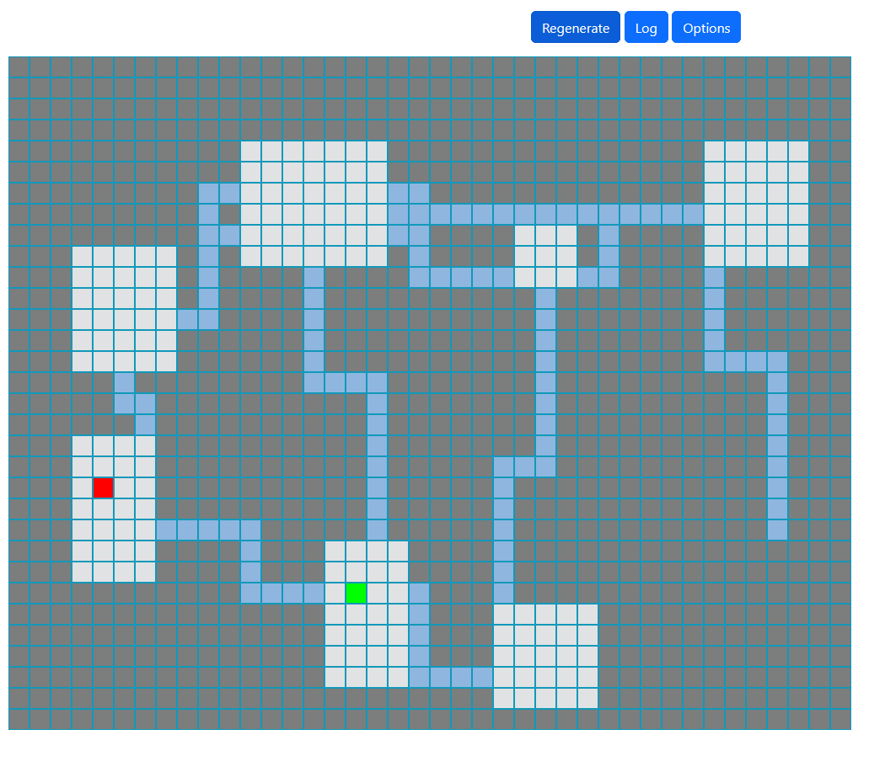

# Dungeon Generator

A procedural dungeon generator that creates connected rooms with corridor-style paths, inspired by the dungeon design of the Pokémon Mystery Dungeon series of games.



## Features

- Grid-based procedural room and corridor generation
- Connected dungeon layouts with guaranteed accessibility between all rooms
- Long, straight corridors between rooms (Pokémon Mystery Dungeon style)
- Entry and exit points automatically placed in separate rooms
- Configurable dungeon parameters (size, room count, room dimensions)
- Interactive visualization using PixiJS
- Seeded random generation for reproducible dungeons

## How It Works

The `Dungeon` class in [dungeonGen.js](dungeonGen.js) creates procedurally generated dungeons using the following approach:

1. **Grid Creation**: Divides the dungeon area into grid sections based on the desired room count
2. **Path Generation**: Places points in each grid section and connects them with straight corridors
3. **Room Placement**: Creates rooms around these points, ensuring rooms contain their grid's connection point
4. **Validation**: Ensures all areas are accessible and that there are enough rooms
5. **Special Points**: Designates entry and exit rooms/points

This "paths first, rooms second" approach ensures connectivity throughout the dungeon while maintaining the characteristic long corridor style.

## Pokémon Mystery Dungeon Style

Unlike many roguelike dungeon generators that create winding, maze-like corridors, this generator is designed to mimic the style found in Pokémon Mystery Dungeon games:

- Straight, long corridors connecting rooms
- Clear distinction between room and corridor areas
- Grid-aligned structures
- More open, less maze-like layouts

## Using the Dungeon Generator in Your Code

```javascript
import Dungeon from './dungeonGen.js';

// Create a dungeon with default settings
const dungeon = new Dungeon();

// Or with custom options
const customDungeon = new Dungeon({
  rowCount: 40,
  colCount: 50,
  roomCountMin: 10,
  roomCountMax: 16,
  minRoomSizeX: 4,
  minRoomSizeY: 4,
  maxRoomSizeX: 8,
  maxRoomSizeY: 8,
  seed: 12345 // Optional: for reproducible dungeons
});

// Access dungeon data
console.log(dungeon.roomList);
console.log(dungeon.board);

// Check if a position is walkable
if (dungeon.isWalkable(x, y)) {
  // Move character here
}

// Get tile information
const tile = dungeon.getTileAt(x, y);
```

## License

MIT

---

Created by Colgate - [Github](https://github.com/RamonaPrower)
